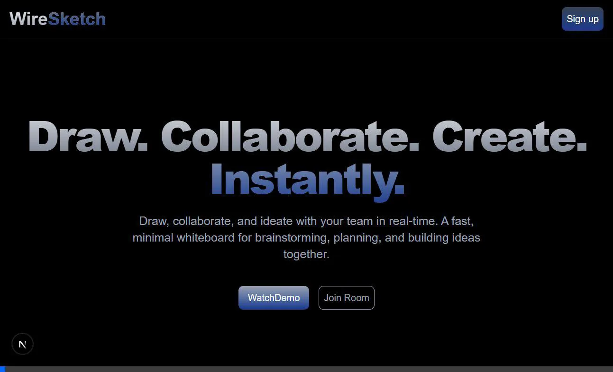
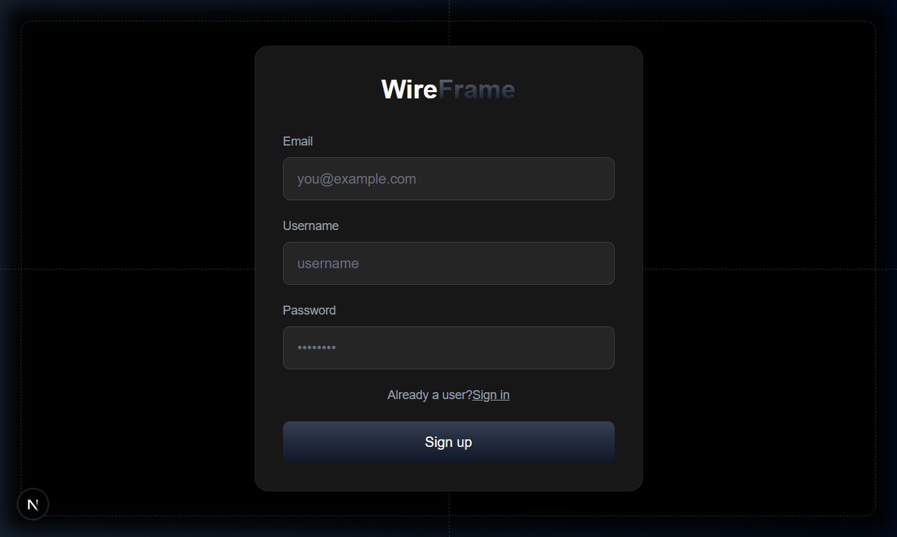
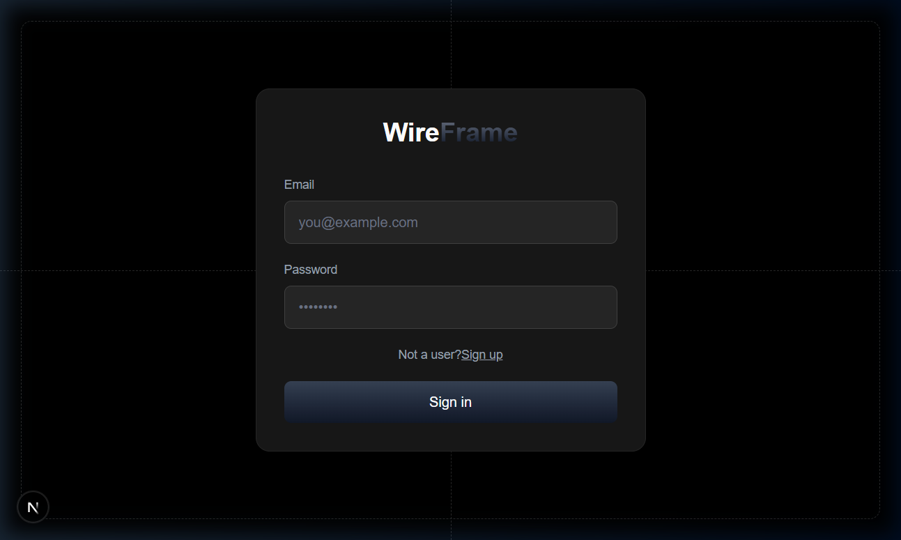
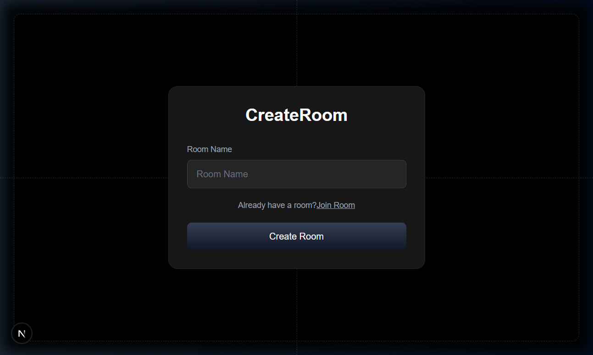
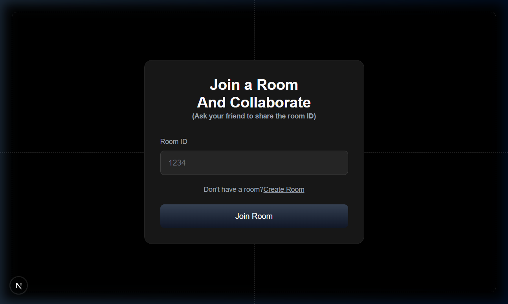
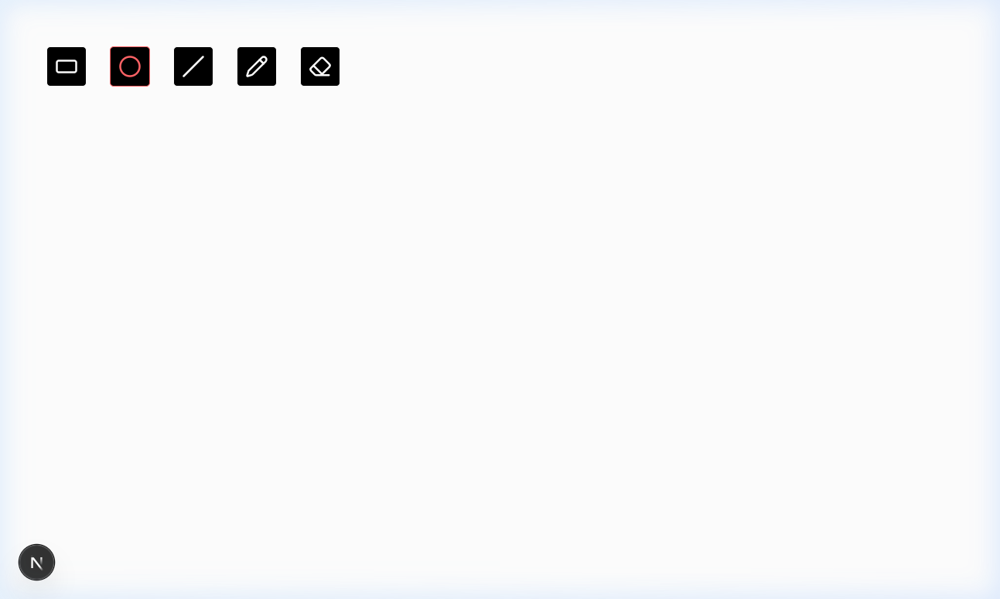
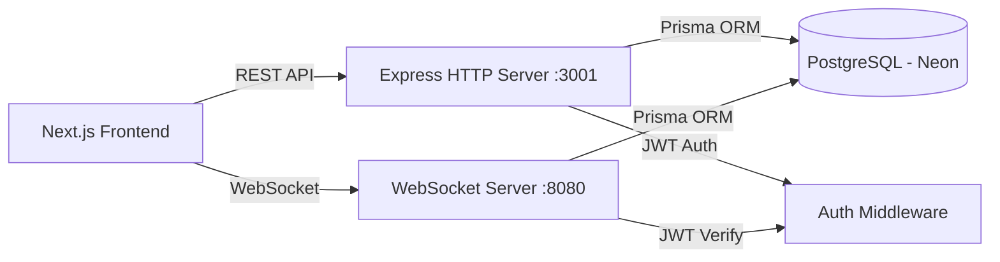

<p align="center">
  <h1 align="center">🎨 WireSketch</h1>
  <p align="center">
    <strong>A real-time collaborative whiteboard for teams to draw, brainstorm, and build ideas together.</strong>
  </p>
  <p align="center">
    <a href="#tech-stack"></a>
    <a href="#tech-stack"></a>
    <a href="#tech-stack"></a>
    <a href="#tech-stack"></a>
    <a href="#tech-stack"></a>
    <a href="#tech-stack"></a>
  </p>
</p>

---

## 📖 Overview

**WireSketch** is a full-stack, real-time collaborative drawing application that enables multiple users to sketch on a shared canvas simultaneously. Built with a modern turborepo monorepo architecture, it separates concerns across a Next.js frontend, an Express HTTP API, and a WebSocket server for live synchronization.

Whether you're wireframing a UI, brainstorming with your team, or just sketching ideas — WireSketch provides a fast, minimal, and distraction-free canvas experience.

---

## 📸 Screenshots

### Landing Page
The home page introduces WireSketch with a bold gradient hero section and calls-to-action to get started.



---

### Sign Up
Create a new account with email, username, and password. Features a sleek dark UI with dashed grid lines.



---

### Sign In
Returning users can sign in with their credentials to access their rooms.



---

### Create Room
Authenticated users can create a new collaborative drawing room by providing a unique room name.



---

### Join Room
Join an existing room by entering the Room ID shared by a friend or teammate.



---

### Canvas (Drawing Board)
The full-screen drawing canvas with a floating toolbar supporting **Rectangle**, **Circle**, **Line**, **Pencil**, and **Eraser** tools. All strokes are synced in real-time via WebSocket.



---

## 🏗️ Architecture

```
draw-app/ (Turborepo Monorepo)
├── apps/
│   ├── drawapp-frontend/     # Next.js 16 — Client UI & Canvas
│   ├── http-backend/         # Express 5 — REST API (Auth, Rooms, Chats)
│   └── ws-backend/           # WebSocket Server — Real-time sync
│
├── packages/
│   ├── db/                   # Prisma ORM — Schema & database client
│   ├── common/               # Shared Zod schemas (validation)
│   ├── backend-common/       # Shared backend config (JWT secret)
│   ├── ui/                   # Shared UI components
│   ├── eslint-config/        # Shared ESLint configuration
│   └── typescript-config/    # Shared TypeScript configuration
│
├── turbo.json                # Turborepo pipeline config
├── pnpm-workspace.yaml       # pnpm workspace definition
└── package.json              # Root scripts & tooling
```



---

## 🛠️ Tech Stack

### Frontend
| Technology | Version | Purpose |
|---|---|---|
| [Next.js](https://nextjs.org/) | 16.2.1 | React framework with App Router, SSR |
| [React](https://react.dev/) | 19.2.4 | UI component library |
| [Tailwind CSS](https://tailwindcss.com/) | 4.x | Utility-first CSS framework |
| [Lucide React](https://lucide.dev/) | 1.8.0 | Icon library for drawing tools |
| [Axios](https://axios-http.com/) | 1.13.6 | HTTP client for API requests |
| [React Toastify](https://fkhadra.github.io/react-toastify/) | 11.0.5 | Toast notifications |
| [HTML5 Canvas API](https://developer.mozilla.org/en-US/docs/Web/API/Canvas_API) | Native | 2D drawing engine |

### Backend
| Technology | Version | Purpose |
|---|---|---|
| [Express.js](https://expressjs.com/) | 5.2.1 | HTTP REST API server |
| [ws](https://github.com/websockets/ws) | 8.19.0 | WebSocket server for real-time communication |
| [JSON Web Token](https://github.com/auth0/node-jsonwebtoken) | 9.0.3 | Authentication & authorization |
| [bcrypt](https://github.com/kelektiv/node.bcrypt.js) | 6.0.0 | Password hashing |
| [CORS](https://github.com/expressjs/cors) | 2.8.6 | Cross-Origin Resource Sharing |

### Database & ORM
| Technology | Version | Purpose |
|---|---|---|
| [PostgreSQL](https://www.postgresql.org/) | — | Relational database (hosted on Neon) |
| [Neon](https://neon.tech/) | — | Serverless PostgreSQL provider |
| [Prisma](https://www.prisma.io/) | 5.22.0 | Type-safe ORM for database access |

### DevOps & Tooling
| Technology | Version | Purpose |
|---|---|---|
| [Turborepo](https://turbo.build/) | 2.8.14 | High-performance monorepo build system |
| [pnpm](https://pnpm.io/) | 9.0.0 | Fast, disk-efficient package manager |
| [TypeScript](https://www.typescriptlang.org/) | 5.9.2 | Static type checking |
| [Zod](https://zod.dev/) | 4.3.6 | Schema validation for API inputs |
| [Prettier](https://prettier.io/) | 3.7.4 | Code formatting |

---

## ✨ Features

- **🎨 Drawing Tools** — Rectangle, Circle, Line, Freehand Pencil, and Eraser
- **⚡ Real-time Collaboration** — Multiple users draw on the same canvas simultaneously via WebSocket
- **🔐 Authentication** — Secure signup/signin with bcrypt-hashed passwords and JWT tokens
- **🏠 Room System** — Create or join rooms for isolated collaborative sessions
- **💾 Persistent Canvas** — All drawings are persisted to PostgreSQL and restored on reconnect
- **🖥️ Full-Screen Canvas** — Distraction-free, viewport-sized drawing area
- **📱 Responsive Design** — Dark-themed UI that adapts to all screen sizes
- **🔔 Toast Notifications** — User-friendly feedback for all actions

---

## 🚀 Getting Started

### Prerequisites

Ensure the following are installed on your system:

- **Node.js** ≥ 18.x — [Download](https://nodejs.org/)
- **pnpm** ≥ 9.0.0 — Install via `npm install -g pnpm`
- **PostgreSQL** — Use [Neon](https://neon.tech/) (recommended) or a local instance

### 1. Clone the Repository

```bash
git clone https://github.com/siddharthasiddu11/draw-app.git
cd draw-app
```

### 2. Install Dependencies

```bash
pnpm install
```

### 3. Configure Environment Variables

Create a `.env` file inside `packages/db/`:

```bash
# packages/db/.env
DATABASE_URL="postgresql://<user>:<password>@<host>/<database>?sslmode=require"
```

> 💡 **Tip:** Sign up at [neon.tech](https://neon.tech/) for a free serverless PostgreSQL instance and copy the connection string.

### 4. Set Up the Database

Navigate to the `packages/db` directory and run Prisma migrations:

```bash
cd packages/db
npx prisma migrate dev --name init
npx prisma generate
cd ../..
```

### 5. Start the Development Servers

From the root of the project, start all services simultaneously:

```bash
pnpm run dev
```

This spins up:
| Service | URL | Description |
|---|---|---|
| **Frontend** | `http://localhost:3000` | Next.js client application |
| **HTTP Backend** | `http://localhost:3001` | REST API for auth, rooms, chats |
| **WebSocket Server** | `ws://localhost:8080` | Real-time drawing synchronization |

### 6. Open in Browser

Navigate to [http://localhost:3000](http://localhost:3000) and start drawing! 🎉

---

## 📂 API Endpoints

### HTTP Backend (`http://localhost:3001`)

| Method | Endpoint | Auth | Description |
|---|---|---|---|
| `POST` | `/signup` | ❌ | Register a new user |
| `POST` | `/signin` | ❌ | Authenticate & receive JWT |
| `POST` | `/room` | ✅ Bearer Token | Create a new drawing room |
| `GET` | `/room/:slug` | ❌ | Get room details by slug |
| `GET` | `/chats/:roomId` | ❌ | Fetch drawing history for a room |

### WebSocket Messages (`ws://localhost:8080`)

| Type | Direction | Payload | Description |
|---|---|---|---|
| `join_room` | Client → Server | `{ type, roomId }` | Join a drawing room |
| `leave_room` | Client → Server | `{ type, room }` | Leave a drawing room |
| `chat` | Client ↔ Server | `{ type, message, roomId }` | Send/receive shape data |

---

## 🗄️ Database Schema

```prisma
model User {
  id        String   @id @default(uuid())
  email     String   @unique
  password  String
  name      String
  photo     String?
  room      Room[]
  chats     Chat[]
}

model Room {
  id        Int      @id @default(autoincrement())
  slug      String   @unique
  createdAt DateTime @default(now())
  adminId   String
  admin     User     @relation(fields: [adminId], references: [id])
  chats     Chat[]
}

model Chat {
  id      Int    @id @default(autoincrement())
  roomId  Int
  message String
  userId  String
  room    Room   @relation(fields: [roomId], references: [id])
  user    User   @relation(fields: [userId], references: [id])
}
```

---

## 📜 Available Scripts

Run these from the **project root**:

| Command | Description |
|---|---|
| `pnpm run dev` | Start all services in development mode |
| `pnpm run build` | Build all packages and apps |
| `pnpm run lint` | Run ESLint across the monorepo |
| `pnpm run format` | Format code with Prettier |
| `pnpm run check-types` | TypeScript type checking |

---

## 🧩 Project Packages

| Package | Path | Description |
|---|---|---|
| `@repo/db` | `packages/db` | Prisma client & database schema |
| `@repo/common` | `packages/common` | Shared Zod validation schemas |
| `@repo/backend-common` | `packages/backend-common` | Shared backend configuration (JWT secret) |
| `@repo/ui` | `packages/ui` | Shared React UI components |
| `@repo/eslint-config` | `packages/eslint-config` | Shared ESLint rules |
| `@repo/typescript-config` | `packages/typescript-config` | Shared `tsconfig.json` presets |

---

## 🔒 Security Notes

> ⚠️ **Important for Production:**
> - Replace the hardcoded `JWT_SECRET` in `packages/backend-common/src/index.ts` with an environment variable
> - Never commit `.env` files with real credentials
> - Add rate limiting to authentication endpoints
> - Enable HTTPS in production

---

## 🤝 Contributing

1. Fork the repository
2. Create your feature branch: `git checkout -b feature/amazing-feature`
3. Commit your changes: `git commit -m 'Add amazing feature'`
4. Push to the branch: `git push origin feature/amazing-feature`
5. Open a Pull Request

---

## 📄 License

This project is licensed under the **ISC License**.

---

<p align="center">
  Built with ❤️ by <a href="https://github.com/siddharthasiddu11">Siddhartha</a>
</p>
